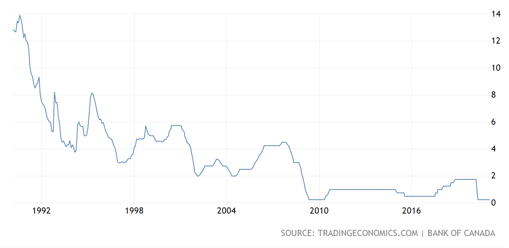
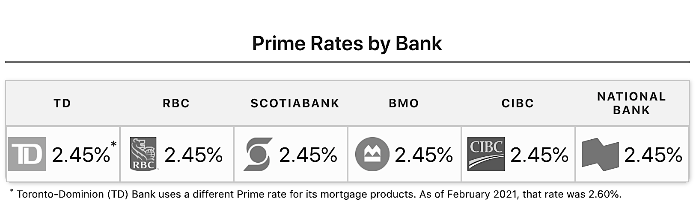

One of the most common questions that homeowners want to know when securing a mortgage is "what rate can I get?". The answer is, it depends. So what do rates depend on? And what do all these numbers mean for you?  

## The Overnight Rate

The Bank of Canada sets a rate called the overnight rate. Several times each year, The Bank of Canada make adjustments to the overnight interest rate. This rate has varied greatly, from 21.75% in 1980 to 0.25% after the financial crisis in 2018. Now, with the covid-19 pandemic causing uncertainty for many homeowners, Canada's overnight rate is again at it's historical low of 0.25%. 

Great, so can I get a mortgage at 0.25%? No.

## Lender's Prime Rates

###### source: wowa.ca

The overnight rate is the interest rate that commercial banks charge when lending to each other -- not the rate that you can get as a consumer. As an individual, the more relevant rate is the prime rate that individual lenders set. This rate is based on the prime rate and historically fluctuates 2-3% above the Bank of Canada's prime rate. For example, First National, TD & Scotiabank all currently advertise a prime rate of 2.45%. 

Ok, so does that mean my mortgage rate will be around 2.45%? Maybe.

## What Mortgage Rate Can I Get?

The rate that a lender will offer you depends not just on the state of the economy and the rates set by the Government of Canada, but also on the risk that they associate with you -- the individual borrower.

### Your Financial Story

A borrower with a perfect credit score, a history of on time payments, a large down payment and low debt ratios may qualify for a mortgage rate of prime minus several basis points. Conversly, a borrower with past credit issues, less than a 20% down payment, or a high debt ratio may need to pay a rate that is higher, sometimes significantly higher than a lender's prime rate to qualify for a mortgage product.

In addition to your background, the rate that you will pay depends on several decisions you can make.

### Mortgage Term

The term of the mortgage is the number of years for which you will pay a specific rate on your mortgage. Most mortgage terms in Canada are 2, 3 or 5 years (with 5 being the most common). Depending on the length of term that you choose to be locked in for, the interest rate can vary. Typically the longer the term the lower the interest rate that you can secure. However, if rates are low (as they currently are), lenders may charge a higher interest rate for a longer term because they expect variable rates to go up in the future. 

### Variable vs Fixed Rate

A fixed-rate mortgage means that you pay a specific rate, say 5% for the entire term (eg. 5 years). A variable rate mortgage is an interest rate that changes over time. A fixed-rate mortgage affords a borrower more stability, they know exactly how much their payments will be each month. Fixed-rate mortgages are typically above the lender's prime rate because the lender is taking on the risk in offering the borrower a fixed rate.

In contrast, a variable rate mortgage changes everytime the lender's prime rate changes. If rates go down, this allows borrowers to take advantage of lower rates without needing to refinance. However, if rates rise, the borrower will need to be able to absorb the increase in rate.

## Beyond Rates

So now that you know where rates come from, who sets them, and what factors will affect your rate, we can get to the most important part -- getting a good rate is important, but it's not enough. In addition to the rate that lenders offer, there are also a series of terms to consider; terms like pre-payment options, mortgage insurance, early termination fees and access to credit. When choosing which mortgage is best for you, I will ensure you are getting not just the best rate, but also the best mortgage based on your unique needs.